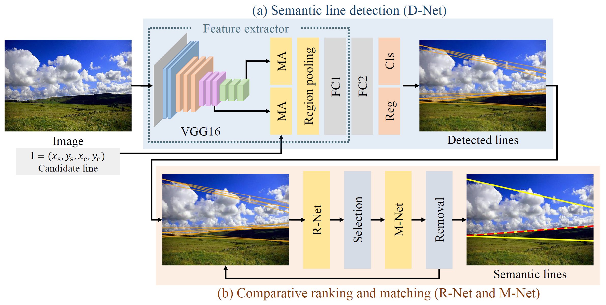

# [ECCV 2020] Semantic Line Detection Using Mirror Attention and Comparative Ranking and Matching
### Dongkwon Jin, Jun-Tae Lee, and Chang-Su Kim


<!--


\\[[Project page]](https://openreview.net/forum?id=bo_lWt_aA)
\\[[arXiv]](https://arxiv.org/abs/2007.08139)
-->

Official implementation for **"Semantic Line Detection Using Mirror Attention and Comparative Ranking and Matching"** 
[[paper]](https://www.ecva.net/papers/eccv_2020/papers_ECCV/papers/123650120.pdf) [[supp]](http://mcl.korea.ac.kr/~dkjin/eccv2020/3397-supp.pdf) [[demo]](http://mcl.korea.ac.kr/dkjin_eccv2020/).

Source code for baseline method (SLNet) is available in [here](https://github.com/dongkwonjin/Semantic-Line-SLNet).

### Requirements
- PyTorch 1.3.1
- CUDA 10.0
- CuDNN 7.6.5
- python 3.6

### Installation
Create conda environment:
```
    $ conda create -n DRM python=3.6 anaconda
    $ conda activate DRM
    $ pip install opencv-python==3.4.2.16
    $ conda install pytorch==1.3.1 torchvision cudatoolkit=10.0 -c pytorch
```

Download repository:
```
    $ git clone https://github.com/dongkwonjin/Semantic-Line-DRM.git
```

### Instruction

1. Download the following datasets to ```root/```. ```SEL``` and ```SEL_Hard``` are datasets for semantic line detection. Others are datasets for applications. We obtain the edge detection results in  ```edge``` folder, by employing [HED algorithm](https://github.com/sniklaus/pytorch-hed).

|        Dataset      |            Custom          |      Original path     |
|:-------------------:|:--------------------------:|:----------------------:|
|          SEL        |          [Download](https://drive.google.com/file/d/1K_lc284Mie-i3o4jEHF4dhObqOS_ITLc/view?usp=sharing)        |          [here](https://github.com/dongkwonjin/Semantic-Line-SLNet)        |
|       SEL_Hard      |          [Download](https://drive.google.com/file/d/1KB-8A39Vnkx-gtiRc1UpgKnfAJKdl8oc/view?usp=sharing)        |                        |
|    AVA landscape    |          [Download](https://drive.google.com/file/d/1TiwkHyh8tfNPP7sFuWWF6lyquh35U_ns/view?usp=sharing)        |          [here](https://faculty.ist.psu.edu/zzhou/projects/vpdetection/)        |
|         ICCV        |          [Download](https://drive.google.com/file/d/1UPOMbQDAOtg7i8k8wyxDqlzQL4rxeryl/view?usp=sharing)        |          [here](https://sites.google.com/view/symcomp17/)        |
|          NYU        |          [Download](https://drive.google.com/file/d/1pkbe9hEmB8yJZwpuz4mjpF9TNsINNeEL/view?usp=sharing)        |          [here](https://symmetry.cs.nyu.edu/)        |
|       SYM_Hard      |          [Download](https://drive.google.com/file/d/17u0zioeyD_mNAgqbOTALFhaS8ZIrpIMF/view?usp=sharing)        |                        |


2. Download our model parameters to ```root/(task_folder_name)/``` if you want to get the performance of the paper.

|                 Task                 |     Model parameters     |
|:------------------------------------:|:------------------------:|
|        Semantic line detection       |        [Download](https://drive.google.com/file/d/1X-FLJDqnfmajFgBWkJPGSdTEq8xYtJo4/view?usp=sharing)        |
|   Dominant parallel line detection   |        [Download](https://drive.google.com/file/d/1CYOUc5vhO8pXl-PRFlJhfDqaDAIb9JB_/view?usp=sharing)        |
|  Reflection symmetry axis detection  |        [Download](https://drive.google.com/file/d/1V19HKSEtuAKM5511nCWCCdi3mcrvbVpu/view?usp=sharing)        |


3. Edit `config.py`. Please modify ```dataset_dir``` and ```paper_weight_dir```. If you want to get the performance of the paper, please input ```run_mode``` to 'test_paper'.

4. Run with 
```
cd Semantic-Line-DRM-master/(task_folder_name)/(model_folder_name)/code/
python main.py
```


### Reference
```
@Inproceedings{
    Jin2020DRM,
    title={Semantic Line Detection Using Mirror Attention and Comparative Ranking and Matching},
    author={Dongkwon Jin, Jun-Tae Lee, and Chang-Su Kim},
    booktitle={ECCV},
    year={2020}
}
```
